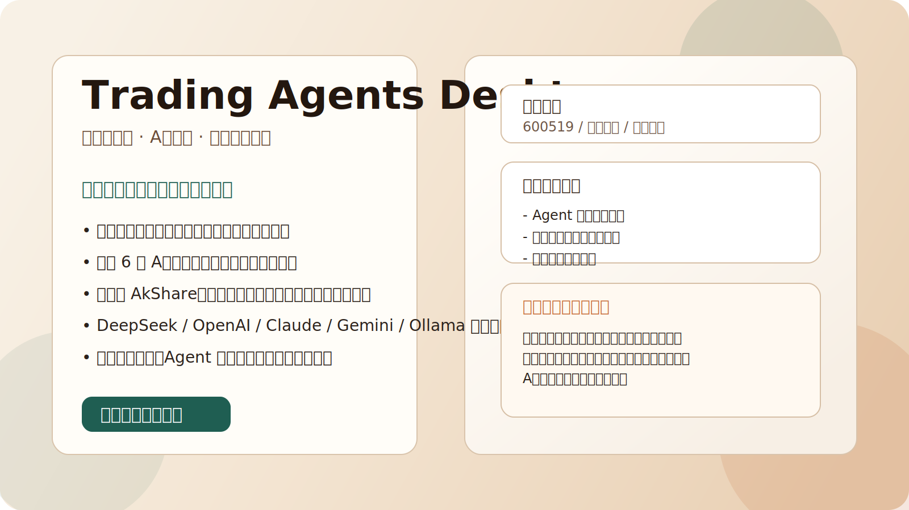
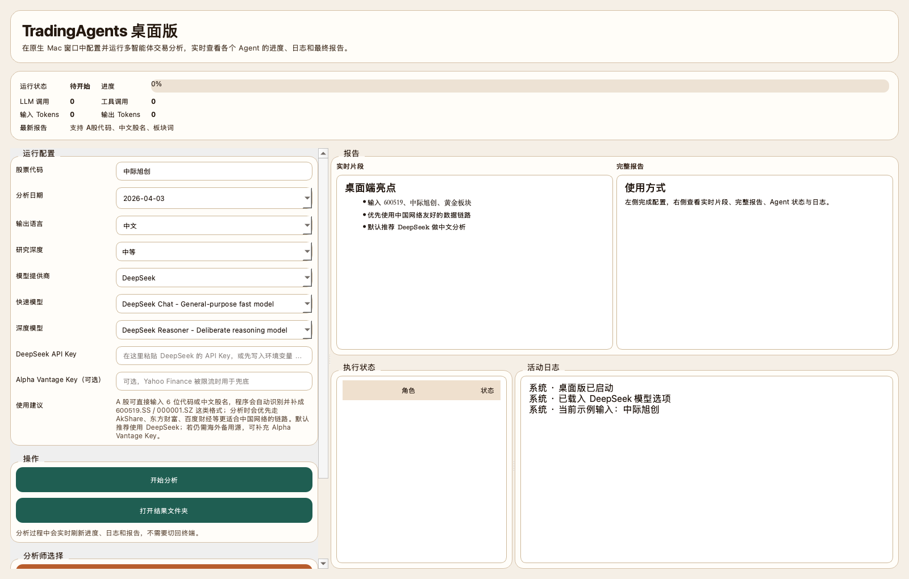
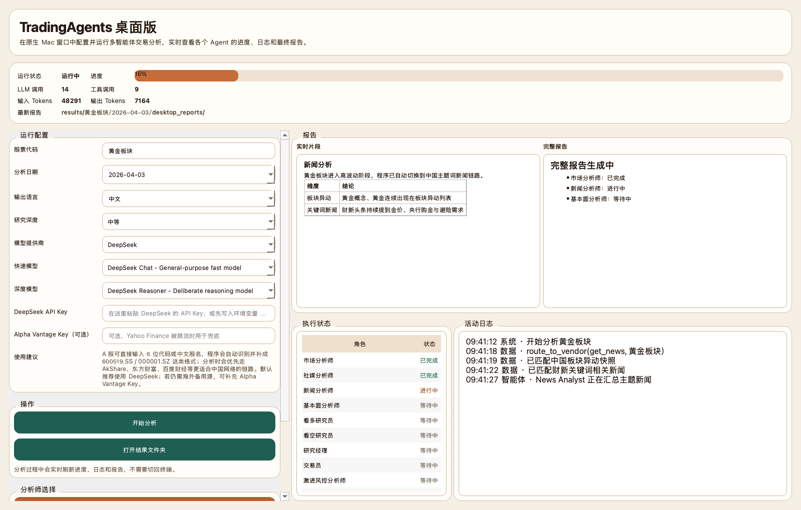
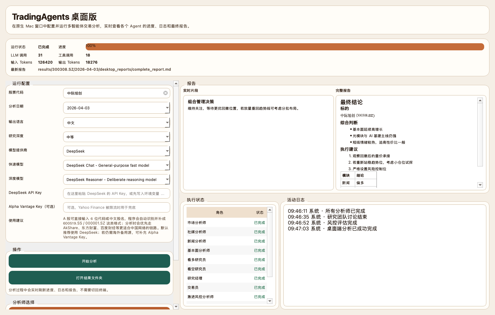

# Trading Agents Desktop

<p align="center">
  
</p>

<p align="center">
  <a href="https://github.com/xiaobei56/trading_agents_desktop/actions/workflows/desktop-build.yml">
    
  </a>
  
  
  
</p>

一个面向中文投资场景重构的 `TradingAgents` 桌面版 fork。

这个版本重点解决了原项目在中文/A 股环境下的几个核心问题：
- 提供原生桌面端界面，避免频繁走命令行
- 优先适配 A 股和中国网络环境
- 支持 `DeepSeek` 等更适合中文场景的模型提供商
- 支持输入 6 位代码、带交易所代码，或中文股票名
- 在中国链路下优先使用 `AkShare`、腾讯证券、新浪财经、东方财富、财新、百度财经等数据源

仓库基于上游 [TauricResearch/TradingAgents](https://github.com/TauricResearch/TradingAgents) 二次开发，保留多智能体分析框架，同时把实际可用性重心放在桌面体验和 A 股分析上。

## 首页截图

### 1. 配置与输入体验

<p align="center">
  
</p>

### 2. 实时执行进度

<p align="center">
  
</p>

### 3. 最终报告结果

<p align="center">
  
</p>

## 主要特性

- 原生桌面客户端
  - 股票代码、模型提供商、模型类型、研究深度都可以在界面里完成配置
  - 实时显示 Agent 执行状态、日志、当前报告片段和最终报告
  - 自动导出分析结果到本地 `results/` 目录

- 中文/A 股增强
  - 支持 `600519`、`000001`、`159915` 这类 6 位代码自动转为 `600519.SS` / `000001.SZ`
  - 支持中文股票名，例如 `中际旭创`
  - 支持中国市场主题词/板块词，例如 `黄金板块`
  - 对 A 股优先走中国市场数据链路，而不是默认依赖 Yahoo Finance

- 多模型提供商
  - `DeepSeek`
  - `OpenAI`
  - `Google Gemini`
  - `Anthropic Claude`
  - `xAI`
  - `OpenRouter`
  - `Ollama`

- 更友好的桌面体验
  - 中文界面
  - 更高对比度配色
  - API Key 会在桌面端设置里自动保存
  - 对常见网络/代理/数据源错误提供更友好的中文提示

## 适合谁

- 主要看 A 股，希望用 LLM 做辅助研究的人
- 不想频繁敲命令、希望直接点界面运行的人
- 想把上游 TradingAgents 当作桌面应用来用，而不是只当研究代码的人

## 环境要求

- Python `3.10+`
- 推荐 Python `3.11` 或 `3.13`
- macOS、Windows 理论上都可运行
- 桌面端依赖 `PySide6`

## 安装

### 1. 克隆仓库

```bash
git clone git@github.com:xiaobei56/trading_agents_desktop.git
cd trading_agents_desktop
```

### 2. 创建虚拟环境

macOS / Linux:

```bash
python3 -m venv .venv
source .venv/bin/activate
```

Windows PowerShell:

```powershell
py -3.11 -m venv .venv
.venv\Scripts\Activate.ps1
```

### 3. 安装依赖

```bash
pip install -U pip
pip install -e .
```

如果你使用 `uv`，也可以：

```bash
uv venv
source .venv/bin/activate
uv pip install -e .
```

## 模型配置

至少配置一个模型提供商的 API Key。

macOS / Linux:

```bash
export DEEPSEEK_API_KEY=your_key
export OPENAI_API_KEY=your_key
export GOOGLE_API_KEY=your_key
export ANTHROPIC_API_KEY=your_key
export XAI_API_KEY=your_key
export OPENROUTER_API_KEY=your_key
export ALPHA_VANTAGE_API_KEY=your_key
```

Windows PowerShell:

```powershell
$env:DEEPSEEK_API_KEY="your_key"
$env:OPENAI_API_KEY="your_key"
$env:GOOGLE_API_KEY="your_key"
$env:ANTHROPIC_API_KEY="your_key"
$env:XAI_API_KEY="your_key"
$env:OPENROUTER_API_KEY="your_key"
$env:ALPHA_VANTAGE_API_KEY="your_key"
```

也可以复制 `.env.example` 为 `.env` 后填写。

```bash
cp .env.example .env
```

推荐：
- 中文/A 股场景优先使用 `DeepSeek`
- 海外备用数据源可以补 `ALPHA_VANTAGE_API_KEY`

## 运行方式

### 桌面版

```bash
tradingagents-desktop
```

### CLI

```bash
tradingagents
```

或者：

```bash
python -m cli.main
```

## A 股输入示例

桌面端和 CLI 都支持以下输入：

- `600519`
- `000001`
- `300308.SZ`
- `sh600519`
- `中际旭创`
- `黄金板块`

其中：
- 个股代码和中文股票名会进入 A 股个股分析链路
- 板块/概念/主题词会优先进入中国财经关键词新闻链路

## 桌面端功能说明

- 左侧配置区
  - 股票代码
  - 分析日期
  - 输出语言
  - 研究深度
  - 模型提供商
  - 快速模型 / 深度模型
  - API Key
  - 分析师选择

- 右侧结果区
  - 实时报告片段
  - 完整报告
  - Agent 执行状态
  - 活动日志

- 结果目录
  - 默认写入 `results/<ticker>/<date>/desktop_reports/`

## 中国市场数据链路

当识别到 A 股或中国主题查询时，程序会优先尝试这些数据源：

- 行情数据：AkShare / 腾讯证券
- 公司新闻：东方财富新闻
- 宏观与市场头条：财新 / 百度财经日历
- 基本面与财报：新浪财经 / 同花顺 / AkShare
- 技术指标：A 股历史数据转技术指标链路

这样做的目标是：
- 降低 `Yahoo Finance` 限流影响
- 降低中国网络环境下的不可用概率
- 让 A 股结果更贴近本地市场语义

## 常见问题

### 1. Yahoo Finance 限流怎么办？

这个 fork 对 A 股已经默认优先走中国链路，很多情况下不再依赖 Yahoo Finance。

如果是非 A 股标的，建议：
- 稍后重试
- 配置 `ALPHA_VANTAGE_API_KEY` 作为备用

### 2. 输入中文股票名或板块名会报错吗？

当前已支持常见中文输入：
- 股票名，例如 `中际旭创`
- 板块/主题词，例如 `黄金板块`

如果后续遇到新的中文查询词不兼容，可以继续补规则。

### 3. Windows 能运行吗？

可以尝试直接运行，当前代码没有绑定 macOS 专有 API，桌面端基于 `PySide6`。

Windows 启动流程通常是：

```powershell
py -3.11 -m venv .venv
.venv\Scripts\Activate.ps1
pip install -e .
tradingagents-desktop
```

### 4. 桌面端 API Key 会自动保存吗？

会。桌面端会按提供商分别保存 API Key 到本机桌面设置中，重新打开应用后会自动回填。

## 打包

### macOS

```bash
./scripts/build_desktop_mac.sh
```

### Windows

```powershell
.\scripts\build_desktop_windows.ps1
```

打包前请先确认：
- 已能在本地虚拟环境中正常运行
- 所需 API Key 已配置
- `PySide6` 已正确安装

更多说明见：

- [桌面端打包指南](docs/release/BUILD_DESKTOP.md)
- [GitHub Release 文案模板](docs/release/GITHUB_RELEASE_COPY_ZH.md)
- [截图规划清单](docs/release/SCREENSHOT_PLAN_ZH.md)

## 项目结构

```text
tradingagents/
  desktop/                 # 桌面端 UI 与运行时
  dataflows/               # 数据源路由与中国市场适配
  llm_clients/             # 多模型提供商适配
  ticker_utils.py          # 股票代码/中文名/A股识别逻辑
cli/
  main.py                  # CLI 入口
tests/
  test_ticker_symbol_handling.py
  test_china_news_queries.py
```

## 说明

- 本项目仅用于研究、学习和辅助分析
- 不构成任何投资建议
- 分析结果依赖模型质量、数据源状态、网络环境和提示词行为

## 上游致谢

本项目基于：

- [TauricResearch/TradingAgents](https://github.com/TauricResearch/TradingAgents)

如果你希望继续沿着桌面版、A 股中国链路、Windows 打包这几个方向迭代，这个 fork 会比直接使用上游更适合作为基础仓库。
